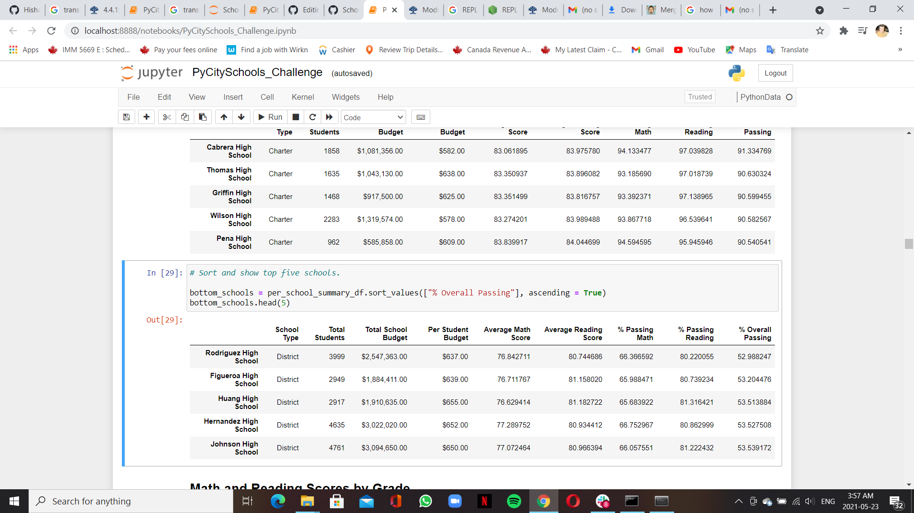
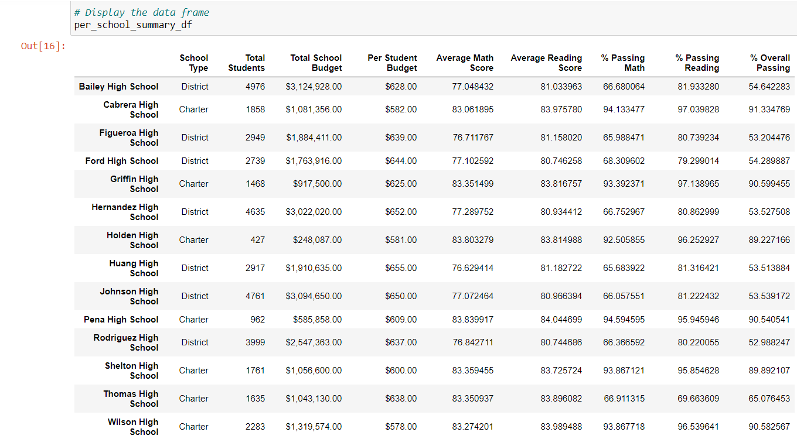

# PyCitySchools_Analysis 

# Overview of the school district analysis
This analysis is  about  
1-Replacing  the 9th-grade data scores at Thomas High School on the other hand analyzing other data. and
2-Assembling data into DataFrame.
3-Arranging Scores by School Spending, Size, and Type
4-Determining the top five schools. and the bottom 5 schools
5-The set of columns we have are, The total school budget, per student capita, average math and reading score, the passing percent for math and reading, and the overall passing percentage.

# Results

                     

What we have done is fixing small portion of data math and reading scores for 9th graders at Thomas High School and we can tell the highest performing schools first   Cabrera High School, second  Thomas High School and third Griffin High School     and Low Performing Schools are  Rodriguez High School, Figueroa High School, and Huang High School

                       

Overall, the change we Have made affects the averages and percent passing at Thomas High School where the math and reading scores for 9th graders at Thomas High School were removed.

# Summary
This Analysis can help us get the right total students, the number of students counted at Thomas High School, the average math and reading scores, and the percentages in Passing Math and reading at Thomas High School. Which we can see a difference average scores and score percentages, we can tell the highest performing schools
and Low Performing Schools

# Results

What we have done is fixing small portion of data math and reading scores for 9th graders at Thomas High School and we can tell the highest performing schools first   Cabrera High School, second  Thomas High School and third Griffin High School     and Low Performing Schools are  Rodriguez High School, Figueroa High School, and Huang High School

Overall, the change we Have made

# Summary
This Analysis can help us get the right total students, the number of students counted at Thomas High School, the average math and reading scores, and the percentages in Passing Math and reading at Thomas High School. Which we can see a difference average scores and score percentages, we can tell the highest performing schools
and Low Performing Schools
